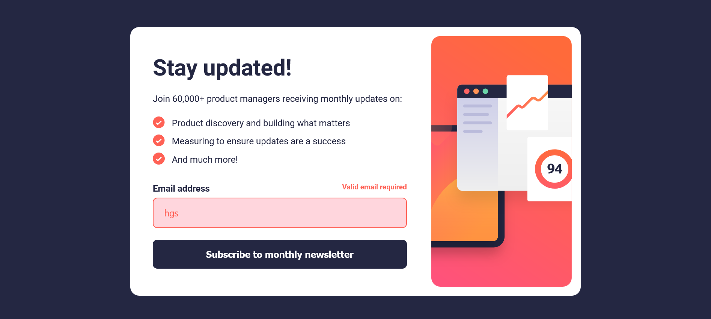

# Frontend Mentor - Newsletter sign-up form with success message solution

This is a solution to the [Newsletter sign-up form with success message challenge on Frontend Mentor](https://www.frontendmentor.io/challenges/newsletter-signup-form-with-success-message-3FC1AZbNrv).

## Table of contents

- [Overview](#overview)
- [Screenshot](#screenshot)
- [Links](#links)
- [Built with](#built-with)

## Overview

This project implements the design for a responsive newsletter sign-up form. Key features include:

A fully responsive layout that transitions from a stacked mobile view to a wide two-column tablet /desktop view.

Client-side email validation upon form submission.

Dynamic display of an error state on the input field for invalid submissions.

Switching the main card content to a separate success message upon successful form submission.

### Screenshot

### Links

- Solution URL: (https://www.frontendmentor.io/solutions/a-responsive-sign-up-form-using-css-and-js-for-validation-fSwsQqkDA1)
- Live Site URL: (https://signupform31.netlify.app/)

### Built with

- Semantic HTML5 markup
- CSS custom properties
- Flexbox
- CSS Grid
- Mobile-first workflow
- Vanilla Java Script
